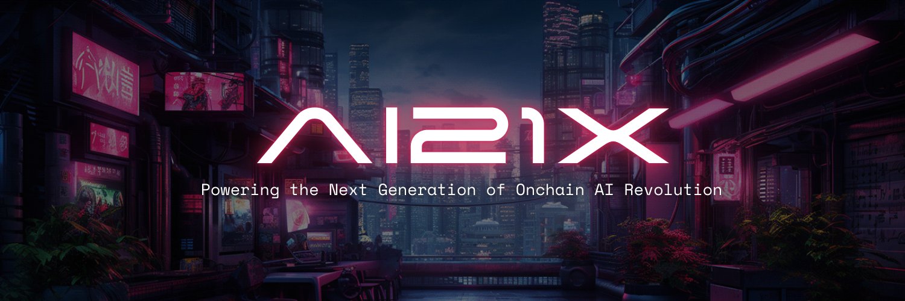

# AI21X Labs 🚀

  

📝 [Whitepaper](#) | 📖 [Documentation](#) | 🛠 [API Reference](#)

## 🌍 README Translations

[中文](i18n/readme/README_CN.md) | [日本語](i18n/readme/README_JA.md) | [Français](i18n/readme/README_FR.md) | [Español](i18n/readme/README_ES.md) | [عربى](i18n/readme/README_AR.md)

## 🚩 Overview

AI21X Labs is an AI-powered decentralized platform supporting multiple AI models, including our own **uncensored AI model**. Our native token, **$AI21X**, fuels the ecosystem and enables next-gen AI services on the **Binance Smart Chain (BSC)**.

## ✨ Features

- 🤖 **Multi-AI Model Support** (Llama, OpenAI, Gemini, and our own Uncensored AI)
- 🌐 **Decentralized AI Processing** on BSC
- 🔗 **On-Chain AI Transactions** using $AI21X
- 🧠 **Retrievable Memory and Document Store**
- 🎮 **Game AI and NFT Integrations**
- ⚡ **Highly Extensible and Open-Source**

## 🎯 Use Cases

- 🤖 AI Chatbots and Assistants
- 🔍 Decentralized AI Search
- 🏦 AI-Powered DeFi Tools
- 🎮 AI in Gaming & NFTs
- 📊 AI-Driven Market Insights

## 🚀 Quick Start

### Prerequisites (Coming Soon)

- Required dependencies and installation steps will be updated soon.

### Running AI21X Services (Coming Soon)

- Detailed setup and run instructions will be added soon.

## 🌎 Community & Support

- 💬 [Discord](#)
- 🐦 [Twitter](#)
- 📢 [Telegram](#)
- ❓ [GitHub Issues](https://github.com/ai21x-labs/ai21x/issues)

## 📜 License

This project is licensed under the MIT License - see the [LICENSE](LICENSE) file for details.

## ⭐ Star History

